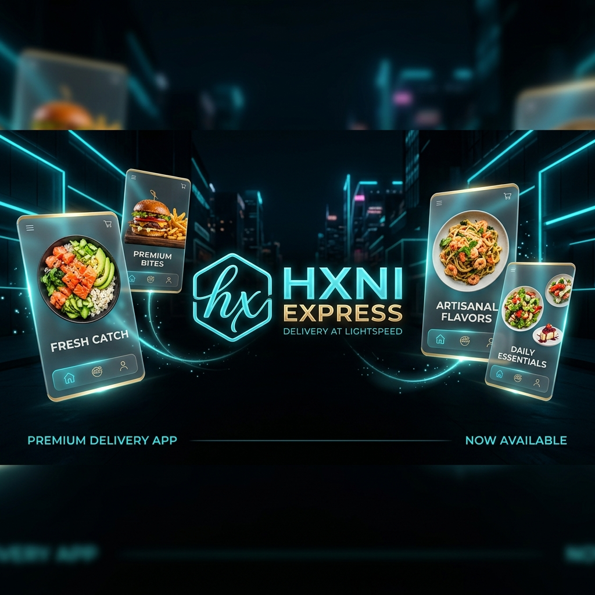
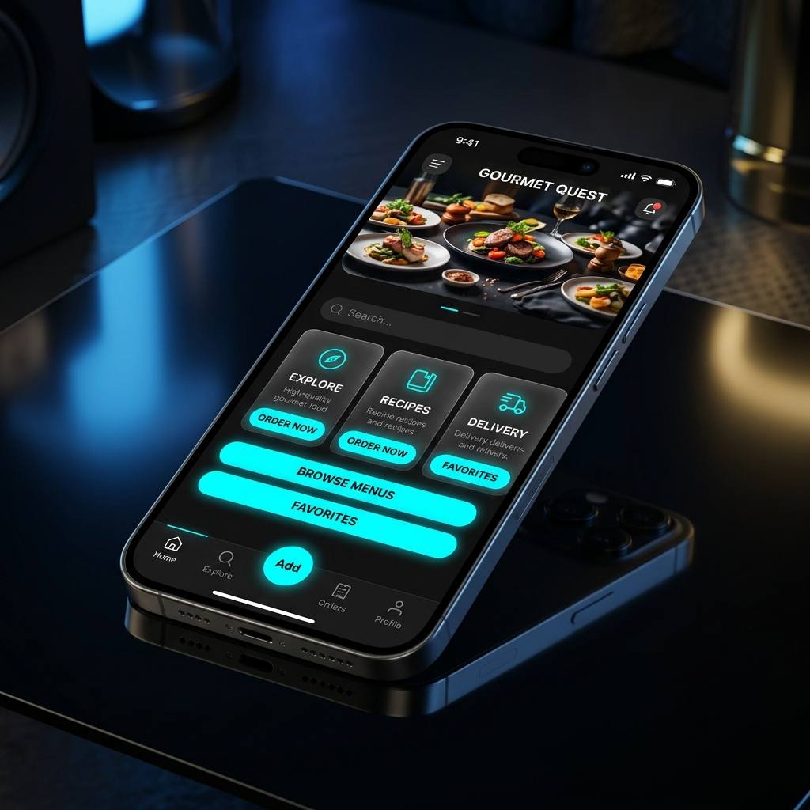

<div align="center">
  
  <h1>hxni Express</h1>
  <p><strong>A Cinematic Full-Stack Mobile Experience</strong></p>
</div>

---

## 📸 Premium Interface Showcase

<div align="center">
  
  <p><em>Experience the stunning "Stitch & Skills" obsidian UI with native parallax animations and glassmorphism.</em></p>
</div>

---

## 🚀 Standalone Installation (Direct APK)

The app is now fully **standalone** and **offline-ready**. All restaurant data is embedded directly into the build.

### 💳 Professional Card Scanner

<div align="center">
  <table style="border: 2px solid #00F2FF; border-radius: 20px; background-color: #0A0A0F; padding: 20px; width: 450px;">
    <tr>
      <td align="center">
        <h2 style="color: #00F2FF; margin-bottom: 5px;">hxni Express</h2>
        <p style="color: #FFD700; font-size: 12px; letter-spacing: 2px;">PREMIUM STANDALONE BUILD</p>
        <br/>
        
        <br/><br/>
        <a href="https://expo.dev/artifacts/eas/r8gqjVW4kGdsj1jnQgpzS6.apk">
          
        </a>
        <p style="color: #666; font-size: 10px; margin-top: 10px;">Scan with Camera to Install</p>
      </td>
    </tr>
  </table>
</div>

---

## ✨ Key Technical Features

*   **Offline-First Architecture**: Zero dependency on external backend servers. Data is injected via local mock streams.
*   **Cinematic UI Architecture**: Highly polished user interface featuring custom animations, blurred glassmorphism cards, and a deep obsidian color palette (`#0a0a0f`).
*   **Parallax Navigation**: Smooth, 60fps native header animations using `Animated.ScrollView`.
*   **Obsidian Brand Identity**: Neon Cyan and Gold accents provide a futuristic, enterprise-grade aesthetic.

---

## 📁 Installation & Setup

### 1. Development Mode
```bash
cd frontend
npm install
npx expo start
```

### 2. Standalone APK
Download the `.apk` from the scanner above and install it directly on any Android device.

---

## 🛠️ Tech Stack

| Layer | Technology |
|-------|-----------|
| **Mobile Frontend** | React Native + Expo (SDK 52) |
| **Logic** | Standalone Embedded Data |
| **Styling** | Custom Glassmorphism System |

---
<div align="center">
  <p>Built with ❤️ using React Native, Node.js & MySQL</p>
</div>
